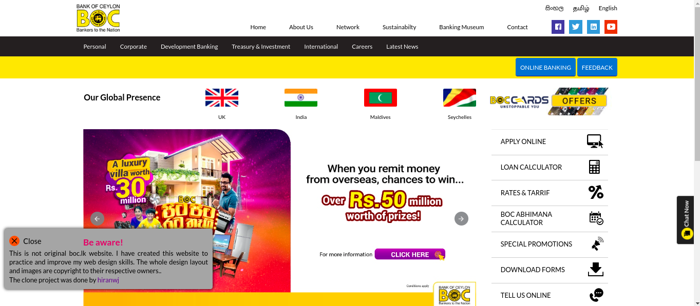

# boc.lk-website-clone
A clone website project of Bank Of Ceylon (BOC) - boc.lk

<!-- ABOUT THE PROJECT -->




<p>This is a clone web site of Bank of Ceylon (BOC) of Sri Lanka. The clone web site was designed for the purpose of learning of HTML and CSS. Images and web site layout credits go to the original designers.</p>

Clone live view : [Click Here](https://hiranwj.github.io/boc.lk-website-clone/)


## Built with using

* HTML 5
* CSS 3
 
## How to use this repository

* Open the terminal
* Then clone the repo using 
```
git clone https://github.com/hiranwj/boc.lk-website-clone.git
```


<!-- CONTACT -->
## Contact

Hiran Wijayathilaka - [@LinkedIn](https://www.linkedin.com/in/hiranwj/)

Project Link: [https://github.com/hiranwj/boc.lk-website-clone.git](https://github.com/hiranwj/boc.lk-website-clone.git)
